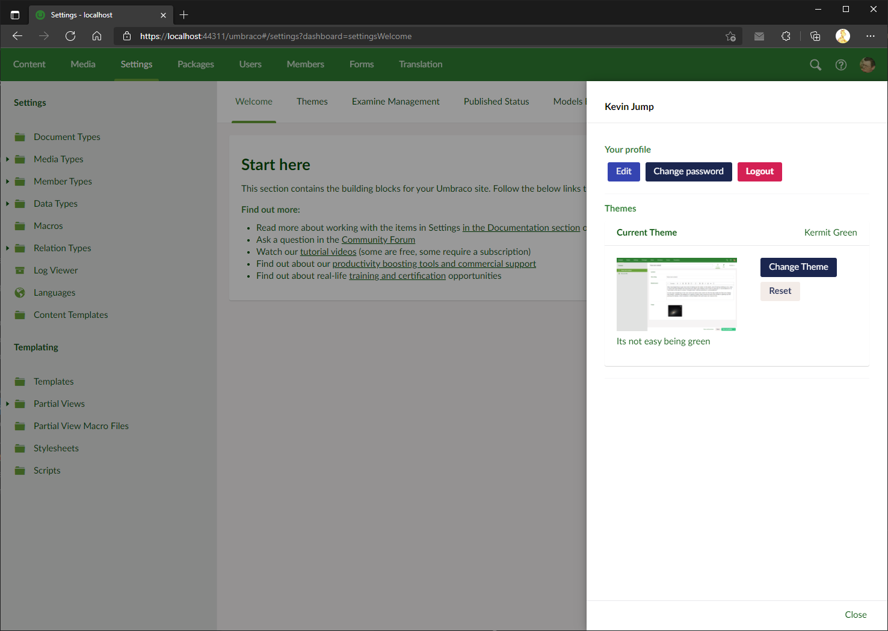

# Our.Umbraco.BackOfficeThemes
Themes for the Umbraco back office  v8 / v9

Install themes for either v8 :

```
install-package Our.Umbraco.BackOfficeThemes
```

or v9 / .NetCore
```
dotnet add package Our.Umbraco.BackOfficeThemes
```

## Users dashboard 
This version of back office themes allows individual users to pick a theme for their back office via a user dashboard which sits behind their avatar in the top right of the Umbraco back office. :



By default we have 5 new themes, but you can add your own, or change the ones included (dark mode needs a little work).

Theme preferences are stored in the DB so will follow you around browsers / machines. 
